# 6.组件间通讯

## 内容

* 组件的输入输出属性
* 使用中间人模式传递数据
* 组件生命周期以及Angular的变化发现机制

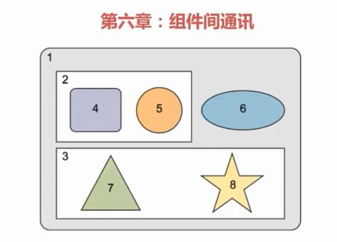

## @Input\(\)

单向绑定，父组件的值影响子组件，子组件的值不会影响父组件。

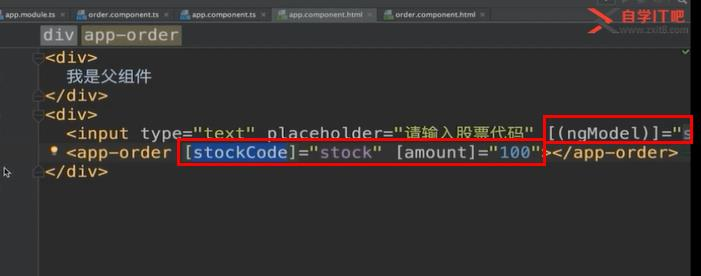

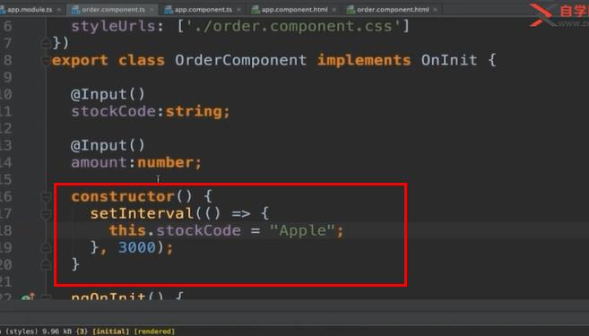

## 路由传递数据

constructor\(routeInfo: ActivateRoute\){}参数订阅和参数快照

将特定的数据结构用类或接口来明确的定义。

## @Output\(\)

使用输出属性向组件外发射事件，并通过事件携带数据，只能通过父组件事件绑定的方式捕获并处理。

使用EventEmitter发射自定义事件，可以被其他组件处理，是subscribe类的子类，可以作为被观察者和观察者。

子组件  
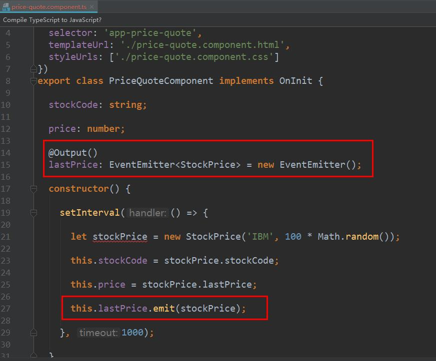

父组件  
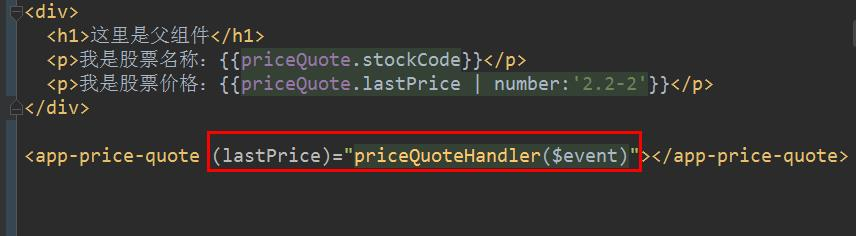

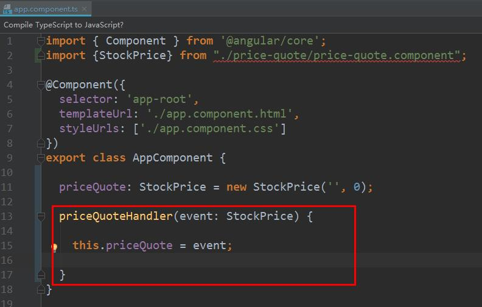

## 中间人模式

父组件下的两个子组件间相互通讯。

如果没有共同的父组件，或者不在同一时刻显示，使用可注入的服务作为中间人，组件可以订阅服务发射的事件流。

## 组件生命周期钩子概述

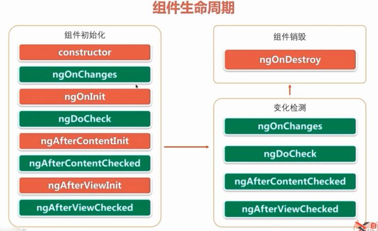

红色的方法只调用一次，绿色的方法会多次调用。

ngOnChanges父组件初始化或修改子组件的输入参数时会被调用

可变对象和不可变对象

string:值不可变，地址可变

对象：值可变，地址不变

Angular的变更监测机制仍然捕获了每个对象的属性改变换。

## 变更检测机制和DoCheck钩子

zone.js实现变更检测机制，使组件属性变化和页面一致，任何异步事件都会出发变更检测。

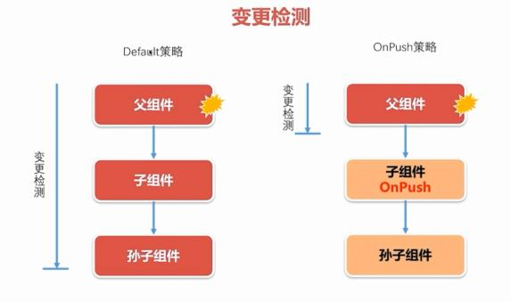

DoCheck会频繁被调用

## VIEW钩子

父组件中调用子组件的方法

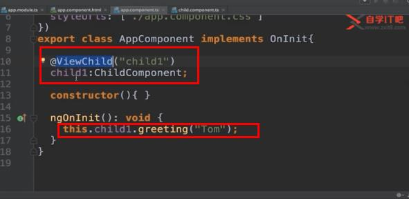

父组件模板中调用子组件的方法

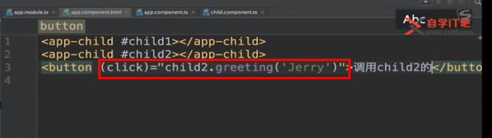

这两个钩子会在组件模板所有的内容被组装好完成以后会被调用

ngAfterViewInit\(\)初始化被调用一次

ngAfterViewChecked\(\)变更检测，精简这个事件，以免出现性能问题

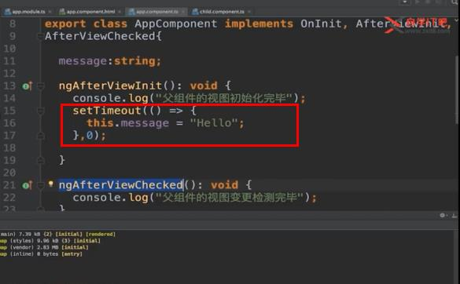

注意：

* 调用顺序，先ngAfterViewInit\(\)后ngAfterViewChecked\(\)，视图被组装完毕后调用
* 当子组件的所有视图组装完毕后，父组件的两个方法才会被掉用
* 不要在这两个方法里改变视图中绑定的东西，可以写在setTimeout里，否则会抛出异常

## 投影特性

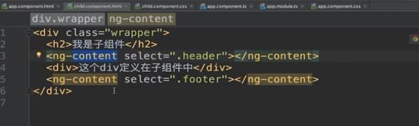

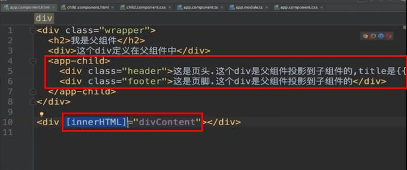

父组件模板中投影的内容使用的插值表达式只能绑定父组件中的属性。

ng-content和innerHTML各有利弊

* ng可以把html应用转为hybirdAPP应用
* ng可以有多个投影点，inner只能插入一段
* ng只能绑定父组件中的属性，inner只能绑定当前组件的内容

## ngAfterContentInit\(\)和ngAfterContentChecked\(\)是在被投影进来的内容组装完调用的

ngAfterContentInit\(\)里可以改变内容

首先组装投影的内容，然后组装子组件中的内容

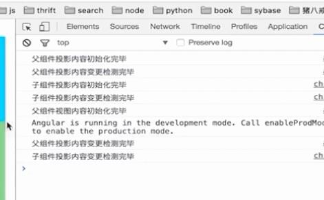

## ngOnDestroy

从一个路由地址跳往另一个路由地址的时候，前一个路由地址对应的组件会被销毁，后一个路由组件被创建

## 实战

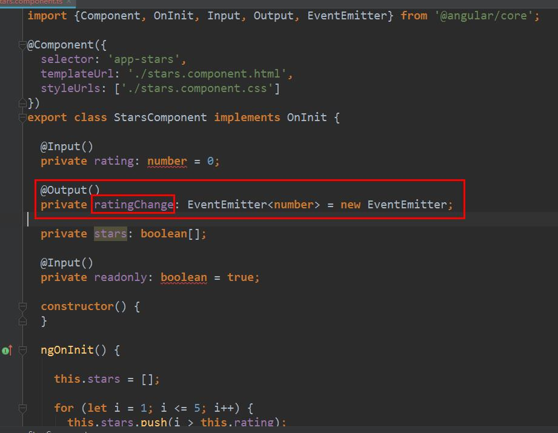

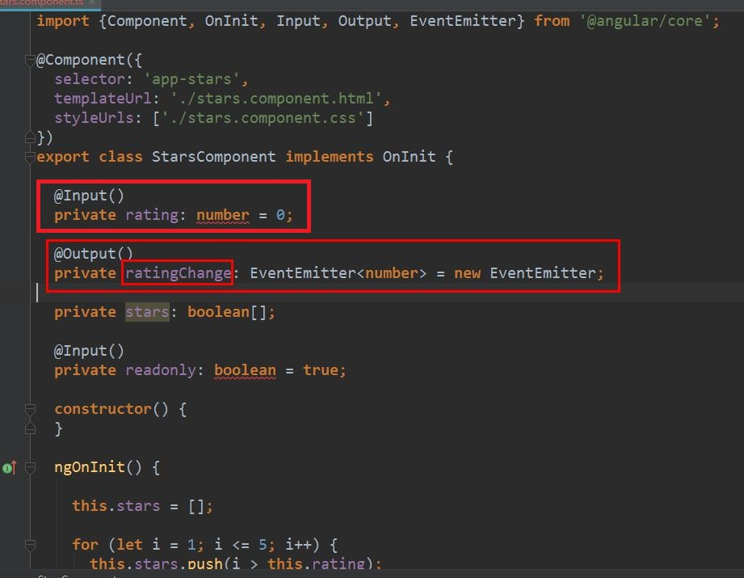

只有这种情况下才能用双向绑定

