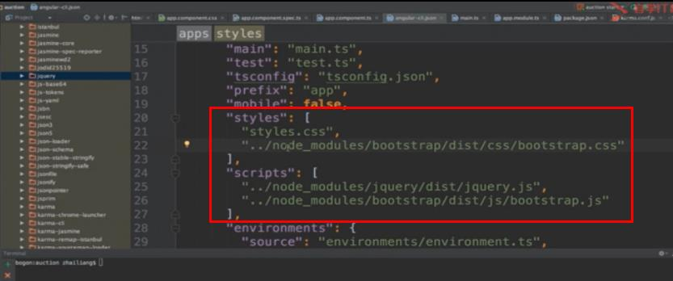
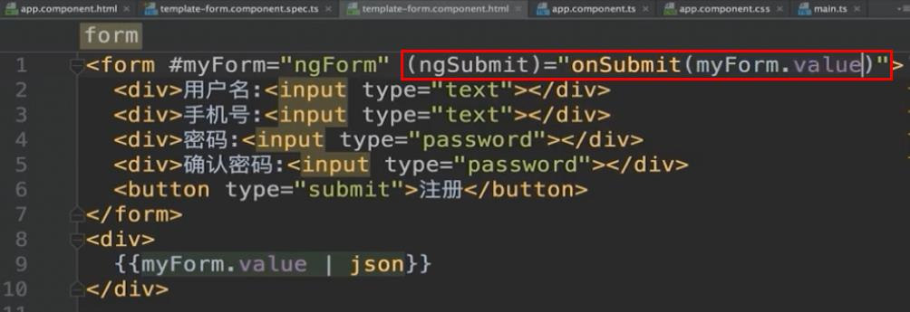

# Angular笔记

## 第三方包的引入

1. 安装第三方包

npm i jquery --save

1. 在.angular-cli.json中引入第三方包

1. 安装类型描述文件\(jquery,bootstrap\)

npm i @types/jquery --save-dev

## keyup.enter事件

`<input type="text" [(ngModel)]="desc" (keyup.enter)="addTodo()">`

## ngSubit事件

## 组件

* 总有要和业务相关的组件，但我倾向于把和业务相关的叫表现型组件，而业务无关的叫可复用组件。可复用组件就像系统内建组件一样，我设置一些属性，你显示就好
* 子组件如果要复用的话最好与业务无关，否则无法复用

