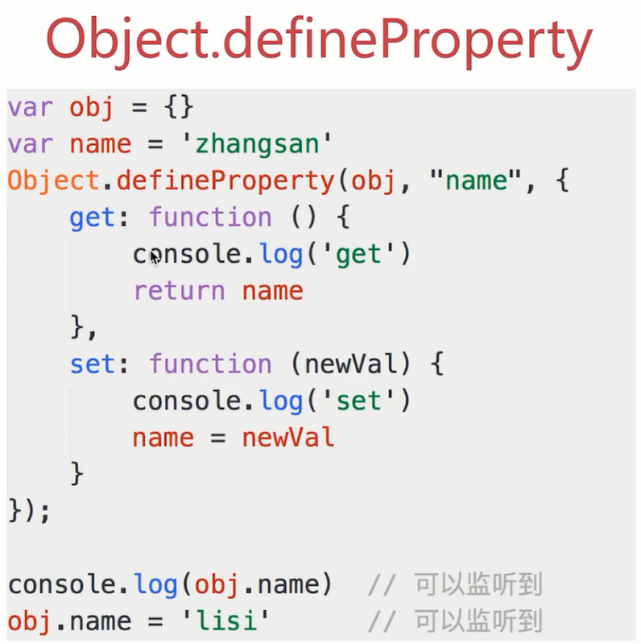

# 5.MVVM

## 如何理解MVVM

## 如何实现MVVM

## 是否解读过vue的源码

## 题目

* 说一下使用jQuery和使用框架的区别\(汇报、演讲、分享\)
* 说一下对MVVM的理解
* vue中如何实现响应式
* vue中如何解析模板
* vue的整个实现流程

## 说一下使用jQuery和使用框架的区别

* 数据和视图的分离，解耦\(开放封闭原则\)
* 以数据驱动视图，只关心数据变化，DOM操作被封装

## 说一下对MVVM的理解

* MVC
* MVVM
* 关于ViewModel连接器 连接Model和View
  * MVVM不算是一种创新
  * 但其中的ViewModel确是一种创新
  * 真正结合前端场景应用的创建

## MVVM框架的三大要素

* 响应式：vue如何监听到data的每个属性变化?
* 模板引擎：vue的模板如何被解析，指令如何处理？
* 渲染：vue的模板如何被渲染成hml?以及渲染过程

## vue中如何实现响应式

* 修改data属性之后，vue立刻监听到
* data属性被代理到vm上

## vue中如何解析模板

* 模板是什么 字符串，有逻辑，嵌入JS变量……；必须转换为JS代码\(有逻辑、渲染html、JS变量\)；render函数执行返回vnode;updateComponent
  * 本质：字符串
  * 有逻辑，如v-if v-for等
  * 与html格式很像，但有很大区别
  * 最终还要转换为html来显示
  * 模板最终必须转换成JS代码，因为：
  * 有逻辑\(v-if v-for\)，必须用JS才能实现\(图灵完备\)
  * 转换为html渲染页面，必须用JS才能实现
  * 因此，模板最终要转换成一个JS函数\(render函数\)
* render函数
* render函数与vdom

## render函数 - with的用法

## render函数

* 模板中所有信息都包含在了render函数中
* this 即 vm
* price 即 this.price 即 vm.price，即 data中的 price
* `_c 即 this._c 即 vm._c`

* 从哪里可以看到render函数？ code.render
* 复杂一点的例子，render函数是什么样子的？
* v-if v-for v-on 都是怎么处理的？
* v-model是怎么实现的？ get/set
* v-on:click是怎么实现的？
* v-for是怎么实现的？
* 已经解决了模板中"逻辑"\(v-for v-if\)的问题
* 还剩下模板生成html的问题
* 另外，vm.\_c是什么？render函数返回了什么？

## render函数和vdm

* vm.\_c其实就相当于snabbdom中的h函数
* render函数执行之后，返回的是vnode
* updateComponent中实现了vdom的patch
* 页面首次渲染执行updateComponent
* data中每次修改属性，执行updateComponent

## vue的整个实现流程

1. 解析模板成render函数
   * with的用法
   * 模板中的所有信息都被render函数包含
   * 模板中用到的data中的属性，都变成了JS变量
   * 模板中的v-model v-for v-on都变成了JS逻辑
   * render函数返回vnode
2. 响应式开始监听
   * Object.defineProperty
   * 将data的属性代理到vm上
3. 首次渲染，显示页面，且绑定依赖
   * 处理渲染，执行updateComponent，执行vm.\_render\(\)
   * 执行render函数，会访问到vm.list和vm.titile
   * 会被响应式的get方法监听到
     * 为何要监听get，直接监听set不行吗？
     * data中有很多属性，有些被用到，有些可能不被用到
     * 被用到的会走get,不被用到的不会走到get
     * 未走到get中的属性，set的时候我们也无需关心
     * 避免不必要的重复渲染
   * 执行updateCopmonent,会走到vdom的patch方法
   * patch将vnode渲染成DOM，初次渲染完成
4. data属性变化，触发rerender
   * 修改属性，被响应式的set监听到
   * set中执行updateComponent
   * updateCompomemt重新执行vm.\_render\(\)
   * 生成的vnode和preVnode，通过patch进行对比
   * 渲染到html中

