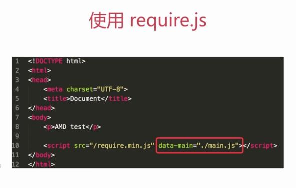
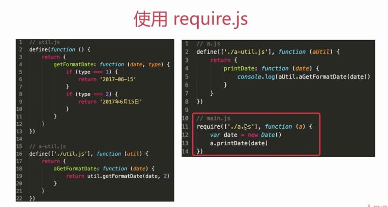
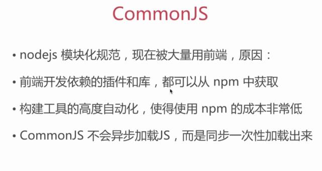
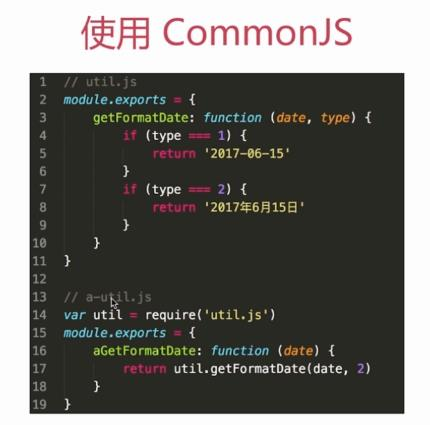
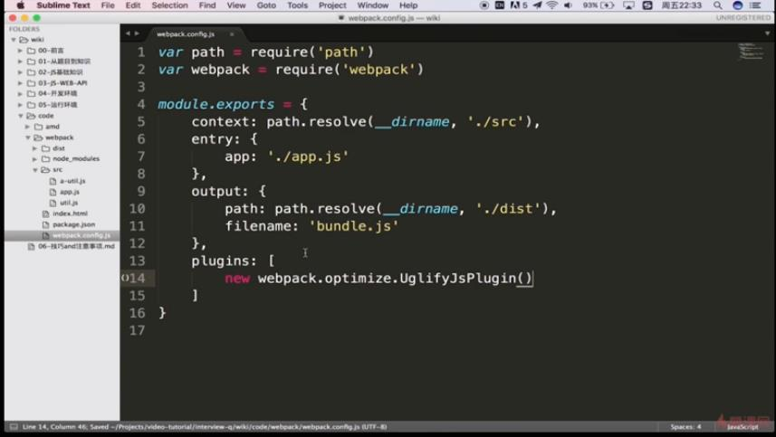

# 6.开发环境

## Git

* git add
* git checkout xxx
* git commit -m "xxx"
* git push origin master
* git pull origin master
* git branch
* git checkout -b xxx / git checkout xxx
* git merge xxx

## 模块化

### AMD（异步模块定义）

* require.js requirejs.org/
* 全局define函数
* 全局require函数
* 依赖JS会自动、异步加载

### CommonJS

### AMD和CommonJS的使用场景

* 需要异步加载JS，使用AMD
* 使用了npm之后建议使用CommonJS

## webpack

## 上线和回滚

* 上线和回滚的基本流程
  * 将测试完成的代码提交到git版本控制的master分支
  * 将当前服务器的代码全部打包并记录版本号，备份
  * 将master分支的代码提交覆盖到线上服务器，生成新版本号
* 将当前服务器的代码打包并记录版本号，备份
* 将备份的上一个版本号解压，覆盖到线上服务器，并生成新的版本号
* linux基本命令
  * 服务器使用linux居多，server版，只有命令行
  * 测试环境要匹配线上环境，因此也是linux
  * 经常需要登录测试机来自己配置、获取数据

mkdir a

ll

ls

cd a

a pwd

cd ..\(e:\)

rm -rf a

vi a.js

cp a.js a1.js

mv a1.js src/a1.js

rm a.js

vim a.js

i esc :w :q :wq //编辑

cat a.js

head a.js //头部

tail a.js //尾部

head -n 1 a.js

tail - n 2 a.js

grep '2' a.js //搜索

