# 4.Http协议类

## Http协议类

* Http协议的主要特点
* Http报文的组成部分
* Http方法
* Post和Get的区别
* Http状态码
* 什么是持久连接
* 什么是管线化

## Http协议的主要特点

* 简单快速 每个资源（url）固定
* 灵活
* 无连接 链接一次就会断掉
* 无状态

## Http报文的组成部分

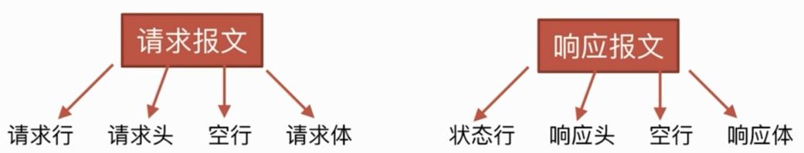

* 请求行 包含http方法，页面地址，http协议，版本
* 请求头 key,value值
* 空行 下面是请求体
* 请求体

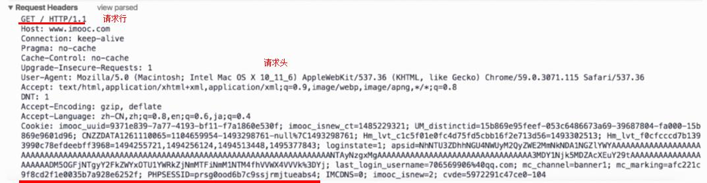

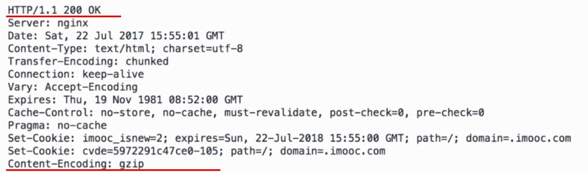

## Http方法

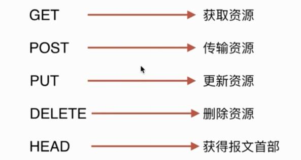

## Post和Get的区别

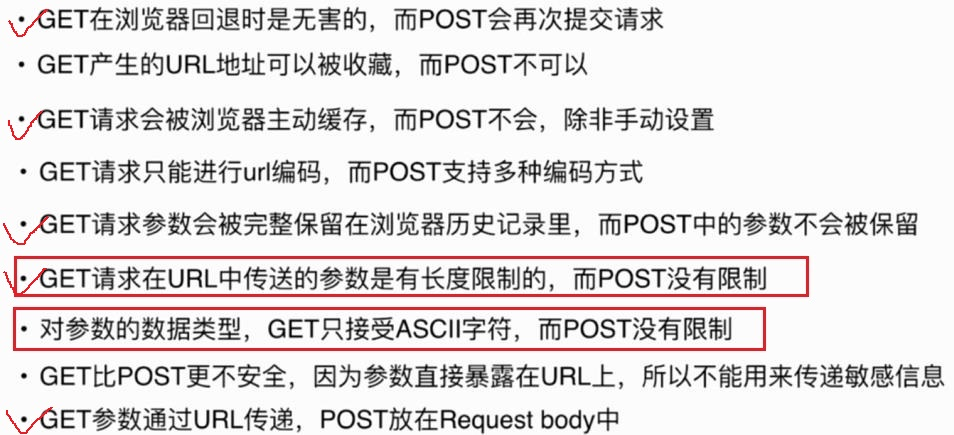

* get请求参数过长\(2kb\)会被截断

## Http状态码

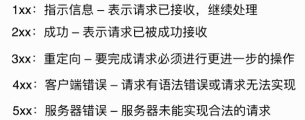

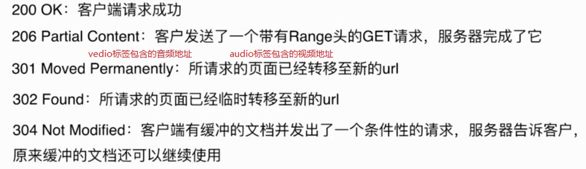

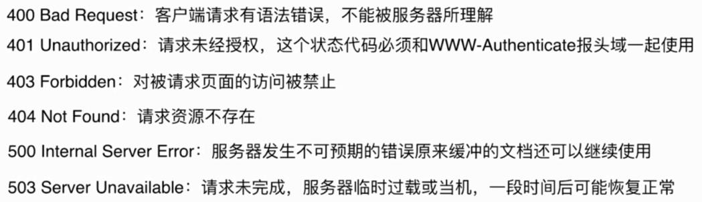

## 持久连接

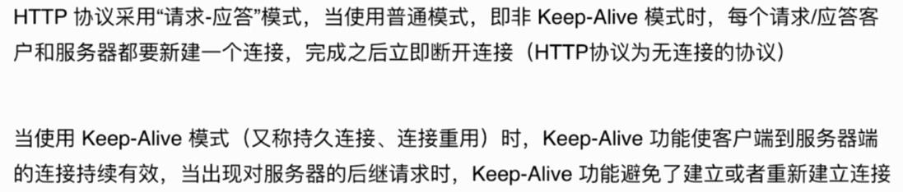

## 管线化

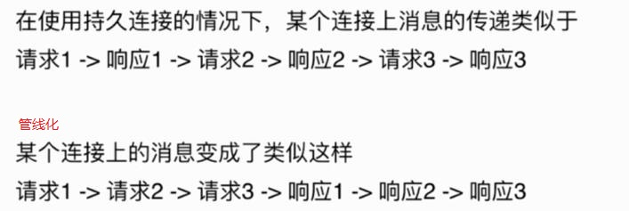

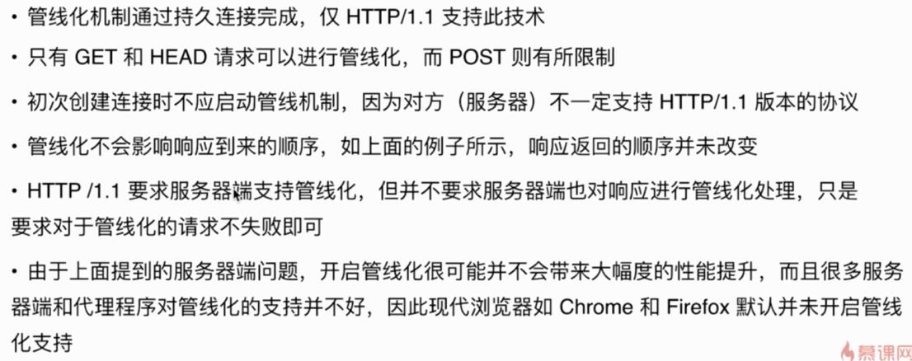

