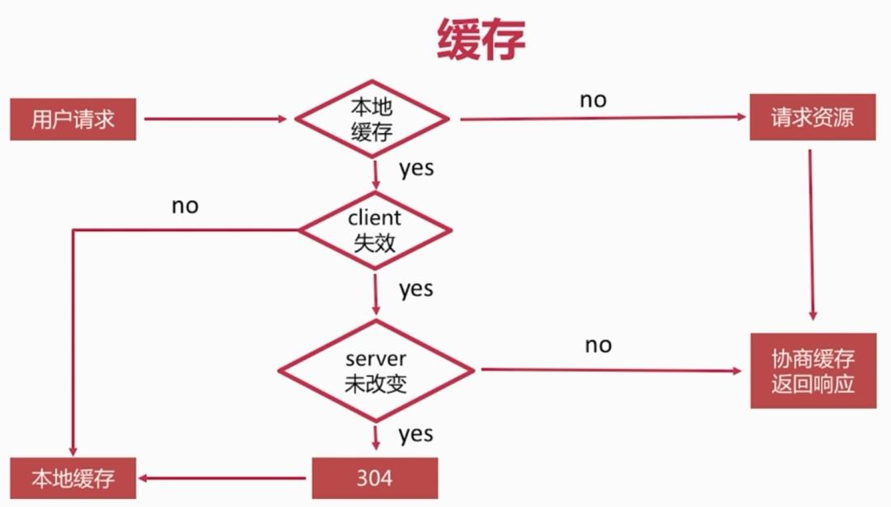

# 5.静态资源服务器

## handlebars模板引擎

## supervisor

监视node下.js文件的变化并重启node

## curl

CURL [http://127.0.0.1:9527/LICENSE](http://127.0.0.1:9527/LICENSE)

CURL -I [http://127.0.0.1:9527/LICENSE](http://127.0.0.1:9527/LICENSE) 不显示文件内容

CURL -i [http://127.0.0.1:9527/LICENSE](http://127.0.0.1:9527/LICENSE)

curl -r 0-10 -i [http://127.0.0.1:9527/LICENSE](http://127.0.0.1:9527/LICENSE)

### 安装curl

`http://blog.csdn.net/ialexanderi/article/details/78726237`

* 下载

[http://curl.haxx.se/download.html](http://curl.haxx.se/download.html)

* 拷贝I386/curl.exe文件到C:\Windows\System32

## 缓存

### 缓存header

* Expires,Cache-Control
* If-Modified-Since/Last-Modified
* If-None-Match/ETag

