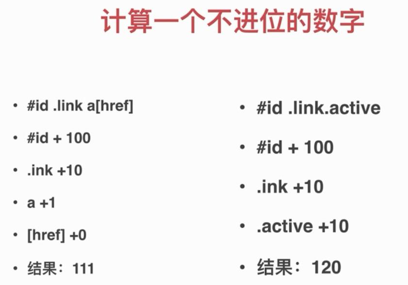
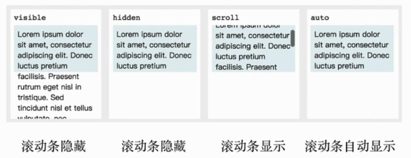

# 2.CSS基础

_\*\*_\#\#CSS基础

* Cascading Style Sheet
* 层叠样式表

## 基本规则

选择器{  
属性： 值；  
属性： 值  
}

;是分隔符不是语句的结束符

## 选择器

* 用于匹配HTML元素
* 分类和权重
* 解析方式和性能
* 值得关注的选择器

## 选择器分类

* 元素选择器 a{}
* 伪元素选择器 ::before{}
* 类选择器 .link{}
* 属性选择器 \[type=radio\]{}
* 伪类选择器 :hover{}
* ID选择器 \#id{}
* 组合选择器 \[type=checkbox\] + label{}
* 否定选择器 :not\(.link\){}
* 通用选择器 \*{}

## 选择器权重

* ID选择器 \#id{} +100
* 类 属性 伪类 +10
* 元素 伪元素 +1
* 其他选择器 +0



* !important优先级最高
* 元素属性（嵌入样式） 优先级高
* 相同权重 后写的生效

## 非布局样式

* 字体、字重、颜色、大小、行高
* 背景、边框
* 滚动、换行
* 粗体、斜体、下划线
* 其他

## 字体

* 字体族
  * serif\(衬线字体:宋体等\)、sans-serif\(非衬线字体:黑体等\)、monospace\(等宽字体\)、cursive\(手写体\)、fantasy\(花体\)
* 多字体fallback
* 网络字体、自定义字体
* iconfont

## 行高

* 行高的构成
  * 由line-box决定的
* 行高相关的现象和方案
  * 居中特性

    ```text
      <div>
          <span style="line-height:60px;">文字</span>
      </div>
    ```
* 行高的调整

```text
    <div style="background:red">
        <span>文字</span>
        
    </div>
```

* img相当于inline元素，遵守行高的构成，按照baseline对齐，图片3px缝隙问题
  * span和img通过baseline对齐，所以img下有缝隙
  * vertical-align:bottom;
  * display:block

## 背景

* 背景颜色
  * background: hsl\(角度\(0-360\), 饱和度\(100%\), 亮度\(100%\)\);
* 渐变色背景
  * background: linear-gradient\(to right, red, green\);
  * background: linear-gradient\(180deg, red, green\);
  * background: linear-gradient\(180deg, red 0, green 10%, yellow 50%, blue 100%\);
  * background: linear-gradient\(135deg, transparent 0, transparent 49.5%, green 49.5%, green 50.5%, transparent 50.5%, transparent 100%\), linear-gradient\(45deg, transparent 0, transparent 49.5%, red 49.5%, red 50.5%, transparent 50.5%, transparent 100%\) ; background-size: 30px 30px;
* 多背景叠加
* 背景图片和属性（雪碧图）
* base64和性能优化
  * 节省http连接数
  * 文件的体积会增大；1.图片本书的体积变为原来的4/3，2.css文件变大
  * 增大了体积开销，增大了解码开销；移动端有明显的影响
  * 只适用于小的图标
* 多分辨率适配

## 边框

* 边框的属性：线型、大小、颜色
* 边框背景图
  * div{

      width: 400px;

      height: 200px;

      border: 30px solid transparent;

      border-image: url\(./border.png\) 30 round;

    }
* 边框衔接（三角形）

## 滚动

* 滚动行为和滚动条



## 文字折行

* overflow-wrap\(word-wrap\)通用换行控制
  * 是否保留单词
* word-break针对多字节文字
  * 中文句子也是单词
* white-space空白处是否断行

## 装饰性属性及其他

* 字重（粗体）font-weight
  * normal\(400\) bold\(700\) bolder lighter
* 斜体font-style:itatic
* 下划线text-decoration
* 指针cursor

## CSS Hack

* Hack即不合法但生效的写法
* 主要用于区分不同浏览器
* 缺点：难理解 难维护 易失效
* 替代方案：特性检测
* 替代方案：针对性加class

标准属性在前，hack在后

### checkbox案例

## 面试

1. CSS样式（选择器）的优先级
   * 计算权重确定
   * ！important
   * 内联样式
   * 后写的优先级高
2. 雪碧图的作用
   * 减少http请求数，提高加载性能
   * 有一些情况下可以减少图片大小
3. 自定义字体的使用场景
   * 宣传/品牌/banner等固定文案
   * 字体图标
4. base64的使用
   * 用于减少http请求
   * 适用于小图片
   * base64的体积约为原图4/3
5. 伪类和伪元素的区别？
   * 伪类表状态
   * 伪元素是真的有元素
   * 前者单冒号，后者双冒号
6. 如何美化checkbox
   * label\[for\]和id
   * 隐藏原生input
   * :checked + label

