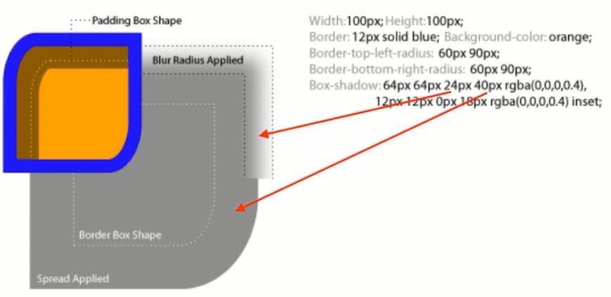

# 4.CSS效果

## 面试题

1. 如何用一个div画xxx
   * box-shadow无限投影
   * before after
2. 如何产生不占空间的边框
   * box-shadow
   * outline
3. 如何实现圆形元素（头像）
   * border-radius: 50%
4. 如何实现ios圆角的图标
   * clip-path: \(svg\)
5. 如何实现半圆、扇形等图形
   * border-radius组合：有无边框，边框粗细，圆角半径
6. 如何实现背景图居中显示/不重复/改变大小
   * background-position
   * background-repeat
   * background-size
7. 如何平移/放大一个元素
   * transform: translateX\(100px\)
   * transform: scale\(2\)
8. 如何实现3D效果
   * perspective: 500px;
   * transform-style: perserve-3d;
   * transfform: translate rotate ...

## box-shadow

* box-shadow: x轴偏移 y轴偏移 阴影模糊区域 阴影扩展区域 颜色 ;
* box-shadow: 0 0 0 5px green; 作为边框
* 增大xy轴偏移，复制一个元素出来
* 用投影做非常多的效果，一个div实现……效果
* 一个元素画叮当猫系列，大量使用点画线

### 作用

* 营造层次感（立体感）
* 充当没有宽度的边框
* 特殊效果

## text-shadow

* 立体感
* 印刷品质感 text-shadow: 0 0 1px rgba\(128,128,128,.2\);
* 黑色背景下，给四周加阴影 第三个属性只能是模糊效果

## border-radius

* 圆角矩形
* 圆形 超过50%不会有影响，仍然是圆形；使用百分比和使用像素相比，百分比不用考虑边框对盒子的影响。
* 半圆/扇形
* 一些奇怪的角角
  * 可单独设置水平方向和垂直方向的圆角 border-radius:10px 10px 10px 10px /20px 20px 20px 20px;
  * border-top-left-radius: 10px 20px;
* 大值特性
* 等比特性
* 垂直在前

## background

* 纹理、图案
* 渐变
* 雪碧图动画
* 背景图尺寸适应

### background属性

* background-size 大小
  * background-size: 100% 100%; 全覆盖，会拉伸
  * cover覆盖整个画面，保持长宽比不变，不会有空白
  * contain长宽比不变，让图片完整显示，会有空白
* background-position 位置
  * background-position: center center; top left
* background-repeat
  * repeat-x
  * no-repeat

## clip-path 按路径裁剪

* 对容器进行裁剪
* 常见几何图形
* 自定义路径

### clip-path写法

* clip-path: inset\(100px 50px\);
* clip-path: circle\(50px at 100px 100px\);
  * 区别于border-radius；仍然占据相应位置。
  * 支持动画，适合做容器内的动画
* clip-path: polygon\(50% 0%, 100% 50%, 50% 100%, 0% 50%\);
* 用svg裁剪各种图形效果

## 3D变换

* 变换transform
  * translate
  * scale
  * skew
  * rotate
  * 属性交换位置，样式不同。矩阵乘法
* perspective 透视距离
* transform-style: preserve-3d;
* transition: transform 1s; 过渡效果

