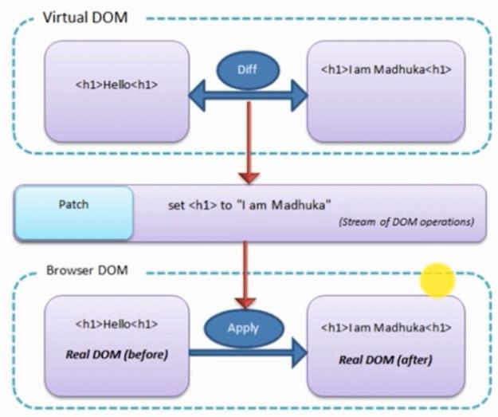

# 1.React组件基础

## 虚拟DOM的结构

## 为什么快

## 如何实现的

开源算法virtual-dom

## React组件

* 组件的return函数返回的html节点必须是一个
* 可以给外部使用的组件的定义：`export default class HeaderComponent extends React.Component{}`
* 入口的定义： `ReactDOM.render(<Index/>, document.getElementById('example'));`

## React多组件嵌套

* 组件也可以通过参数的形式传递

## JSX内置表达式

* 三元表达式的书写,`{name == '' ? '用户未登录' : name}`
* 动态属性值的绑定,`<input type='button' value={name} disabled={tmp}/>`
* 注释`{/*注释*/}`
* HTML要显示可以进行Unicode转码
* HTML要显示还可以用过`

`,注意此方法可能会存在xss攻击

## 生命周期

