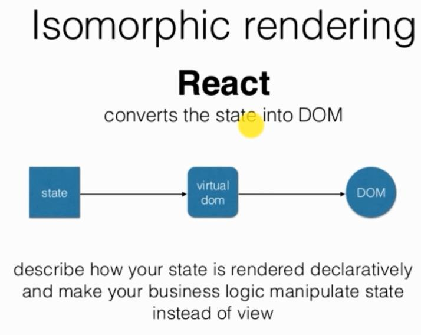

# 2.React属性与事件

## state属性

* 初始化： this.state = {username: 'Parry'};
* 初始化可以放置在构造函数constructor里
* 修改state: this.setState\({username: 'IMOOC'}\);
* state的作用域只属于当前的类，不污染其他模块
* state对于模块属于自身属性

## props属性

* props对于模块属于外来属性
* 传递参数： 
* 模块中接受参数： this.props.username

## 事件与数据的双向绑定

### 事件的绑定

* 注意ES6的语法
  * 可以在构造函数里绑定this： this.forceUpdateHandler = this.forceUpdateHand ler.bind\(this\);
  * 或者调用时绑定： onClick = {this.changeUserInfo.bind\(this, 50\)}
* `<input type="button" value="提交" onClick={this.changeUserInfo.bind(this, 50)}/>`

### 子页面向父页面传递参数的方法

* 在子页面中通过调用父页面传递过来的事件props进行组件间的参数传递
* 为什么不用onBlur

## 可复用组件

* prop验证
* 默认prop值
* 传递所有参数的快捷方式

## 组件的refs

* 原始获取方法: let submitButton = document.getElementById\('submitButton'\);ReactDOM.findDOMNode\(submitButton\).style.color = 'red';
* 方法二的定义： `<input ref='submitButton'/>`
* 方法二的获取：this.refs.submitButton.style.color = 'green';
* refs是访问到组件内部DOM节点唯一可靠的方法
* refs会自动销毁对子组件的引用
* 不要在render或render之前对refs调用
* 不要滥用refs

## 独立组件间共享Mixins

* 不同组件之间公用功能、共享代码
* 和页面具有类似的生命周期
* ES6下的使用需要安装插件： react-mixin

