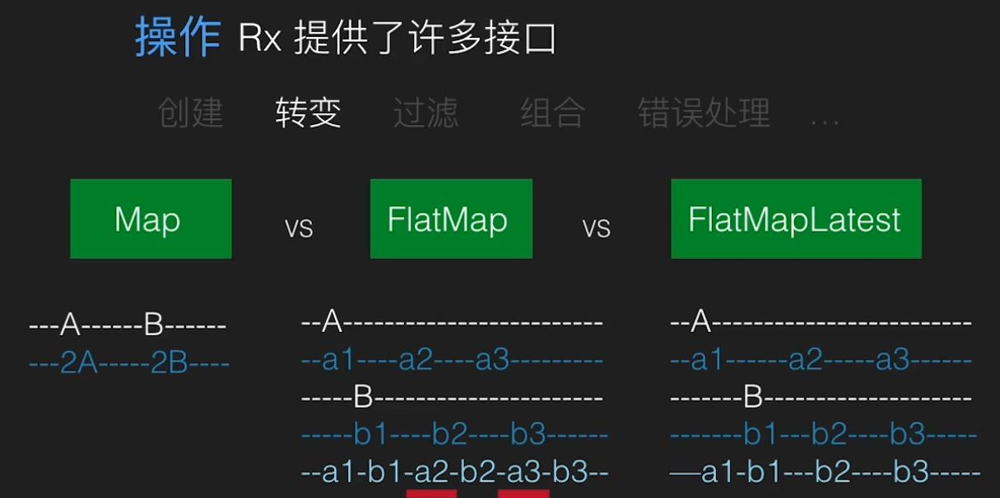
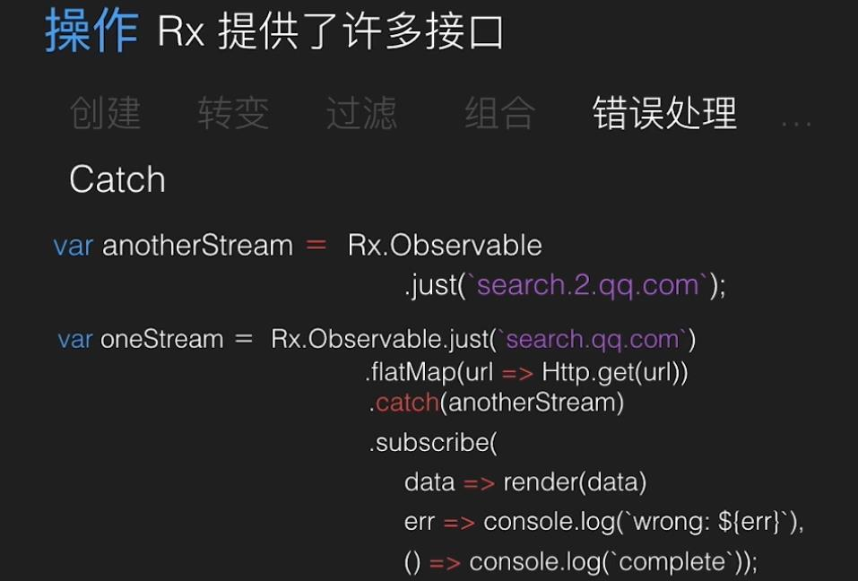
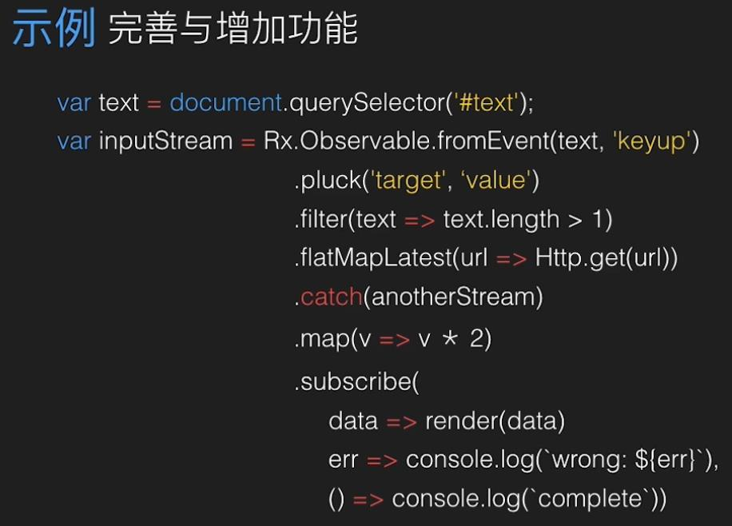
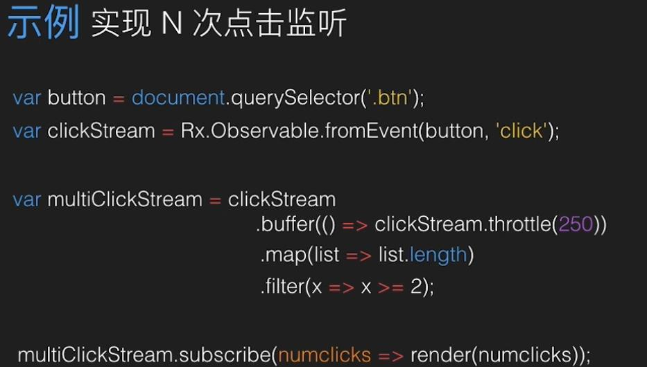

# RxJs

[https://www.imooc.com/video/13640](https://www.imooc.com/video/13640)

流 随时间流逝的一系列事件

上一个流会随着下一个流的产生而被抛弃掉，上一个流的数据不再会经历过最终结果的影响了。

```javascript
var text =document.querSelector("#text");
var anotherStream = Rx.Observable.fromEvent(text,'keydown');
var inputStream = Rx.Observable.fromEvent(text,'keyup')
                .pluck('targeet', 'value')                //类似event,拿到event.target.value的值
                .filter(text => text.length > 1)
                .flatMapLatest(url => Http.get(url))
                .catch(anotherStream)
                .map(v => v * 2)
                .subscribe(
                                data => render(data)
                                err => console.log(`Wrong: ${err}`),
                                () => console.log(`complete`)
                );
```

```javascript
var button = document.querySelector('.btn');
var clickStream = Rx.Observable.fromEvent(button, 'click');

var multiClickStream = clickStream
                                .buffer( () => clickSteam.throttle(250))
                                .map(list => list.length)
                                .filter( x => x >=2 );
multiClickSteam.scribe( numClicks => render(numClicks));
```

## 入门

```text
var streamA$ = Rx.observable.jsut(2)
                .map(s => s*2);                //事件源 
streamA$.subscribe(v => console.log());                //订阅与响应
```

Rx提供了许多接口

创建、转变、过滤、组合、错误处理

### 创建

just、fromEvent

### 转变

* map
* FlatMap
* FlatMapLatest



### 过滤

filter、debounce\(函数节流\)

### 组合

* merge

### 错误处理

catch 如果可观察者的流出错，则执行catch里的可观察者，成功则返回值，不会返回错误。







## 优点

* 代码简洁
* 函数式
* 可组合 链式操作将数据组合在一起
* 伸缩性强（方便改变需求） 随意增删函数
* 错误处理 优雅容错
* 并发处理
* 局部到整体 库，而不是框架
* 同步到异步的统一
* 事件与数据的统一
* 前端和后端
* 与其他框架结合

