# 8.观察者模式

## 介绍

* 发布&订阅
* 一对多

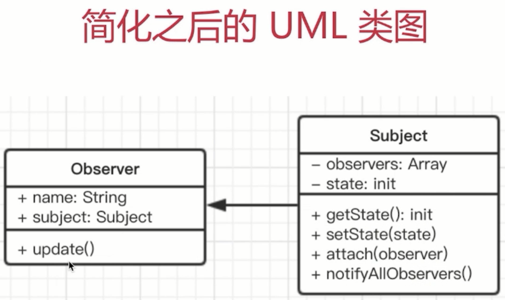

```javascript
//主题，保存状态，状态变化之后触发所有观察者对象、
class Subject{
    constructor(){
        this.state = 0
        this.observers = []
    }
    getState(){
        return this.state
    }
    setState(state){
        this.state = state
        this.notifyAllObservers()
    }
    notifyAllObservers(){
        this.observers.forEach(observer => {
            observer.update()
        })
    }
    attach(observer){
        this.observers.push(observer)
    }
}

//观察者
class Observer{
    constructor(name, subject){
        this.name = name
        this.subject = subject
        this.subject.attach(this)
    }
    update(){
        console.log(`${this.name} update, state: ${this.subject.getState()}`)
    }
}

const s = new Subject()
let o1 = new Observer('o1', s)
let o2 = new Observer('o2', s)
let o3 = new Observer('o3', s)
```

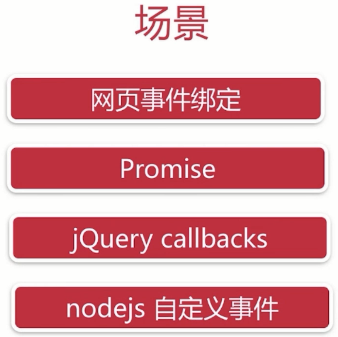

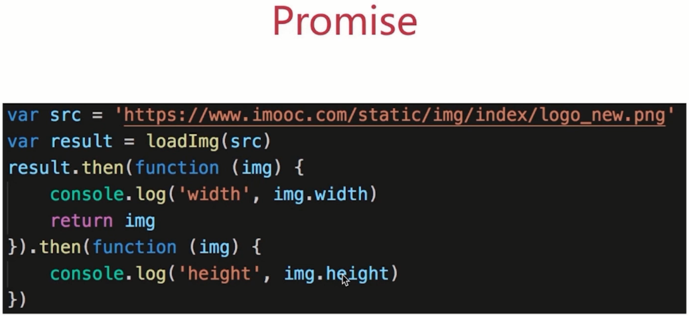

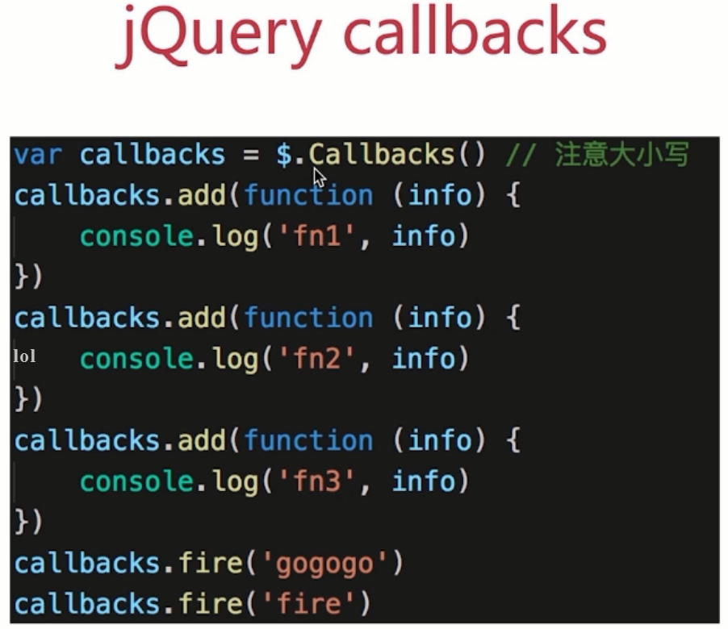

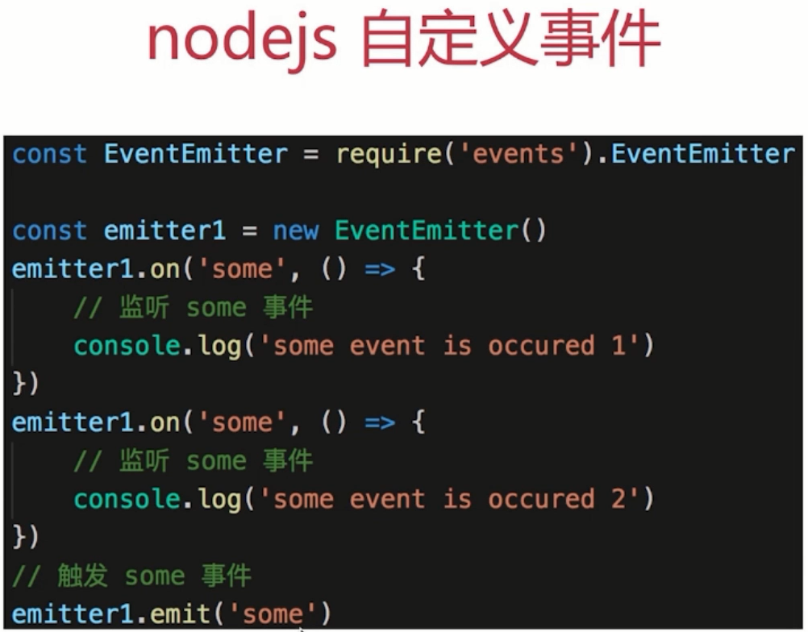

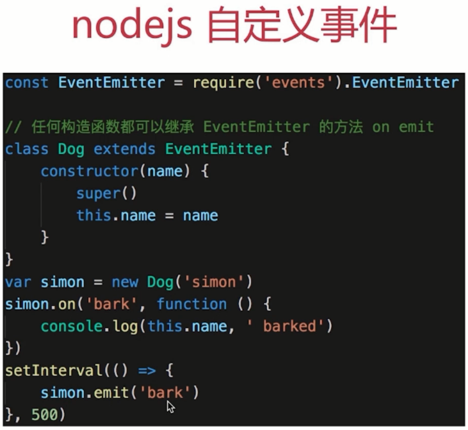

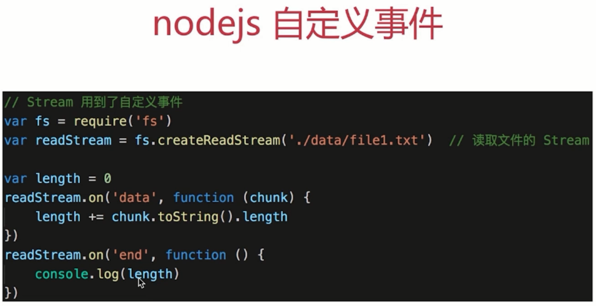

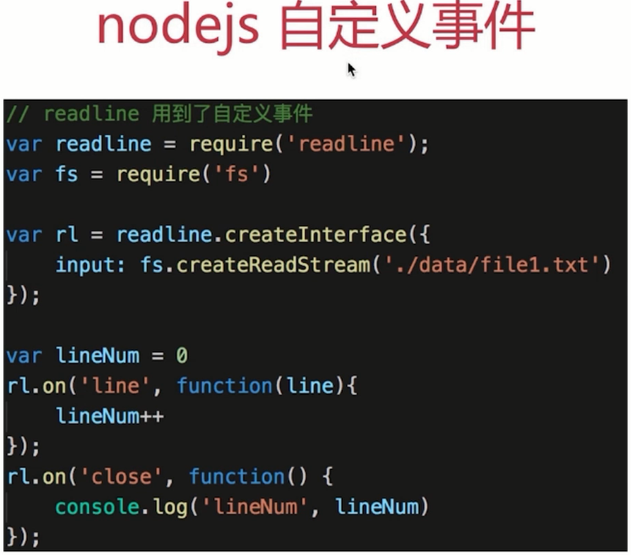

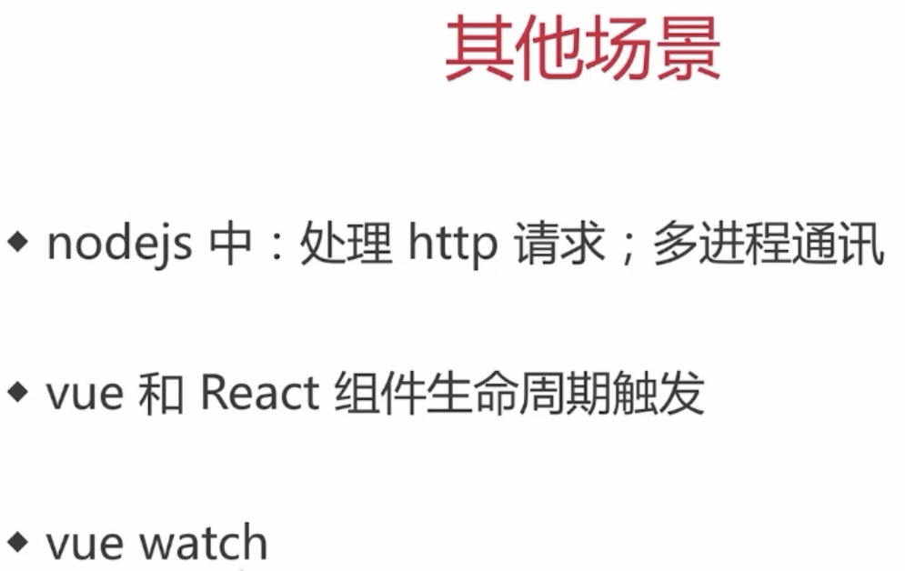

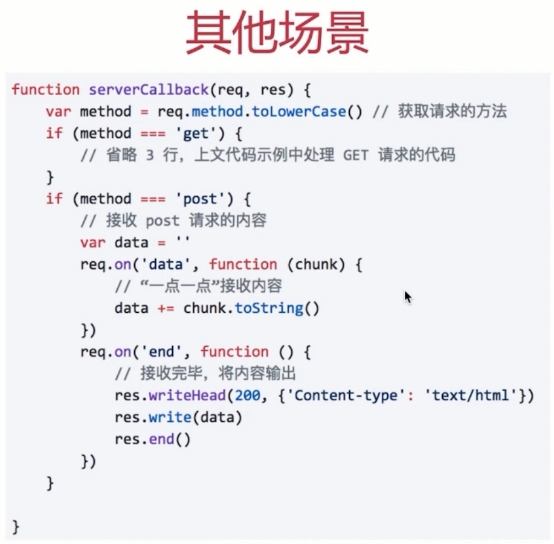

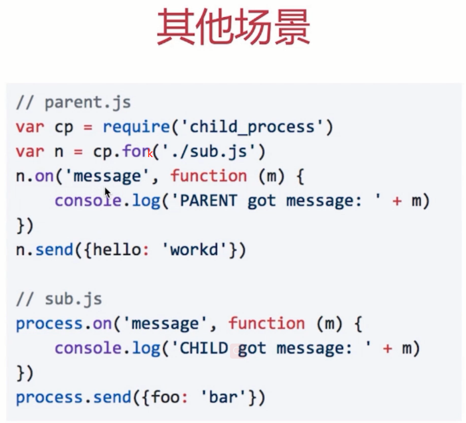

## 设计原则验证

* 主题和观察者分离，不是主动触发而是被动监听，两者解耦
* 符合开放封闭原则

