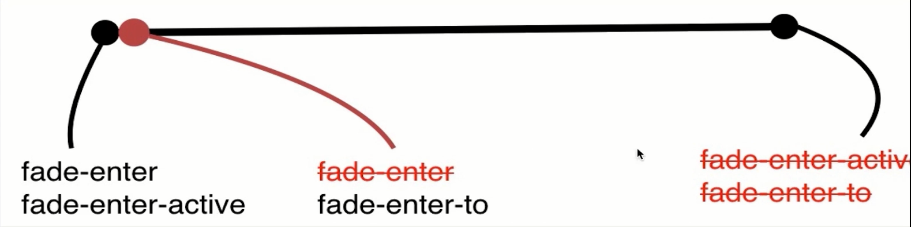

# 2.css动画



## 过渡

* 条件渲染 \(使用 v-if\)
* 条件展示 \(使用 v-show\)
* 动态组件
* 组件根节点

```text
<transition>
    <p v-if="show">hello</p>
</transition>

<style>
.v-enter,
.v-leave-to {
  opacity: 0;
}
.v-enter-active,
.v-leave-active {
  transition: opacity 3s;
}
</style>
```

## 自定义动画名字和animate.css

```markup
<transition enter-active-class="animated swing" leave-active-class="animated shake">
  <d v-if="currentNav === 0">123</p>
</transition>
```

## 同时使用过渡和动画

```text
<transition
    type="transition"
    :duration="5000"
    :duration="{enter: 5000, leave: 10000}"
    name="fade"
    apear
    enter-active-class="animated swing fade-enter-active"
    leave-active-class="animated shake fade-leave-active"
    appear-active-class="animated swing"
>
    <div v-if="show">hello</div>
</transition>

<style>
.fade-enter,
.fade-leave-to {
  opacity: 0;
}
.fade-enter-active,
.fade-leave-active {
  transition: opacity 3s;
}
</style>
```

## js动画

* enter & leave

```markup
<transition
    @before-enter="handleBeforeEnter"
    @eneter="handleEnter"
    @aftereneter="handleAfterEnter"
>
    <div v-if="show">hello</div>
</transition>

var vm = new Vue({
    el: '#root',
    methods: {
        handleBeforeEnter(el){
            el.style.opacity = 0;
        },
        handleEnter(el){
            Velocity(el, {opacity: 1}, {duration: 1000, complete: done});
        },
        handleAfterEnter(el){

        }
    }
});
```

## 多个元素或组件的过渡

* vue在两个元素切换时，会尽量的复用DOM。1.v-if的动画不会出现，加key值；2.mode="in-out"
* 动态组件；mode="in-out"

## 列表过渡

* `transition-group`

## 动画封装

* 可以用js动画

```text
Vue.component('fade', {
    props: ['show'],
    template: `
        <transition>
            <slot v-if="show"></slot>
        </transition>
    `
});
```

