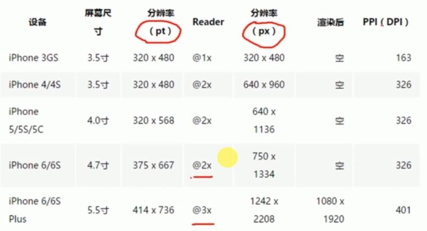

# 微信小程序

## 禁止页面上下滑动

* 如果是一直不让滑动，可以在 page.json 里设 " disableScroll ": false
* 如果是滑一半后要禁用，可以显示一层 fixed 全屏并 catchtouchstart 的空层
* scrool-view bindscrolltolower下拉触底

e.target是点击的元素；e.currentTarget是绑定事件的元素

white-space: nowrap;阻止换行包括view inline-flex

从服务器获取的对象属性值要 判空；尤其二级以上属性

wx.stopPullDownRefresh\(\)停止导航栏刷新

wx.showNavigationBarLoading\(\)导航栏loading效果

this.setData会引起页面的重新渲染；this.data不会

scroll-view设置flex-direction无效

onLoad -&gt; onShow -&gt; onReady

wx.setNavigationBarTitle设置导航栏；但不能在onLoad,onShow 内设置，因为页面还没有生成；在onReady里可以设置；

传参：1.全局变量 2.缓存 3.dataset+url 4.事件发射

template里可以调用父组件里定义的方法

margin：垂直建议用px；水平建议用rpx

对于异步数据setData如果没有在data中预定义，插值表达式会报错！

wx.require\(\)的header里有坑

学习新的东西要多去"试"

设置了display:flex的盒子模型内不能再使用vertical-align

```text
//段落文字的样式
.detail {
  color: #666;
  margin-left: 30rpx;
  margin-top: 20rpx;
  margin-right: 30rpx;
  line-height: 44rpx;
  letter-spacing: 2px;
}
```

for循环下的template的view上加上自定义属性data-postId/data-post-name-id，获取路由需要的值e.currentTarget.dataset.postid/postNameId

template渲染后并没有这个标签，只是占位符

teplate的data=""这样模板里的值更直观

import/image的src可以是绝对或相对路径

require只能用相对路径

小程序总是会先onLoad，然后再读取data对象来做数据绑定

wx:if=""来控制显隐

节点属性的布尔值false，需要的形式，否则无效

生命周期 onLoad\(页面初始化的时候向服务器请求数据\) - onShow - onReady

## 小程序的特点

* 小程序适合做最简单的、用完即走的应用
* 小程序适合低频的应用
* 小程序适应性能要求不高的应用

## 特点

* 不需要下载安装即可使用
* 用户“用完即走”，不用关心是否安装太多应用
* 应用将无处不在，随时可用
  * 人与商品
  * 人与人
  * 人与服务

## 特点

* 业务逻辑简单
* 使用频率低
* 对性能要求低

## 对开发者的影响

* 短期内将提升市场对JavaScript程序员的需求量
* 小程序是0基础开发者很好的入门平台
* 小程序不可以使用现在已经存在的JavaScript组件库
* 开发环境和开发逻辑极其简单，非常适合新手入门

## 编写小程序页面

* 小程序文件类型与目录结构
* 注册小程序页面， View、Image、Text等组件的基本用法
* Flex弹性盒子模型
* 移动端分辨率及小程序自适应单位RPX

## 组件

* 包含text标签内的文字才在手机上能长按选中
* rpx自动转化，ip6的尺寸宽750像素做效果图
* 静态样式以及复用性写在class里，动态样式写在style里，性能上把样式放在style里运行效率会比较低，规范和代码复用性上都应该用class形式编写样式。
* CSS大局观，从整体上解决布局问题是最优的解决方案
* height:100%;仍然是根据内部大小确定高度的

## text

* text可以嵌套控制不同的文本颜色
* 在手机里长按选中
* 解析转义字符如`\n`

## rpx

* 移动设备的分辨率与rpx
  * 从一张设计图的实现说起
  * 为什么模拟器下ip6的分辨率是375而设计图一般给750？ 设计师根据物理分辨率
  * 如何适配不同的机型？



* pt逻辑分辨率，大小和屏幕尺寸有关系，简单可以理解为长度和视觉单位
* px物理分辨率，像素点，点能有大小吗？
* 一个pt可以有1个px构成，也可以有2个，还可以有3个甚至更多组成
* ip6下2个px才构成一个pt
* rpx的作用：以ip6的物理像素750x1334为视觉稿进行设计，而在小程序中使用rpx为单位，ip6下1px = 1rpx = 0.5pt
* 使用rpx，小程序会自动在不同的分辨率下进行转换，而使用px为单位不会
* 不是所有的单位都适合用rpx,例如文字
* 小程序在注册时，并不是注册的某一个文件，而是注册的以welcome开头的所有的文件（js,wxss,wxml,json）,他会自动把welcome相关的四种类型文件关联在一起。

```text
//app.json
{
    "page": [
        "pages/welcome/welcome"
    ],
    "window": {
        "navigationBarBackgroundColor": "#b3d4db"
    }
}

//app.wxss,公共样式
text{
    font-family: MicroSoft Yahei;
}

//welcome.wxss,差异性代码
.container{
    display: flex;
    flex-direction: column;
    align-item: center;    //居中
}
.user-avatar{
    width: 200rpx;
    height: 200rpx;
    margin-top: 160rpx;
}
.user-name{
    margin-top: 100rpx;
    font-size: 32rpx;
    font-weight: bold;
}
.moto-container{
    margin-top: 200rpx;
    border: 1px solid #405f80;
    width: 200rpx;
    height: 80rpx;
    border-radius: 5px;
    text-align: center;
}
.moto{
    font-size: 22rpx;
    font-weight: bold;
    line-height: 80rpx;
    color: #405f80;
}
page{
    height: 100%;
    background: #b3d4db
}

//welcome.wxml
<view class='container'>
    <image class='user-avatar' src='/images/avatar/.png'></image>>
    <text class='user-name'><text style="color:red">Hello\n</text>,七月</text>>
    <view class='moto-container'>
        <text class='moto'>开启小程序之旅</text>
    </view>
</view>


//welcome.js
Page({

})
```

