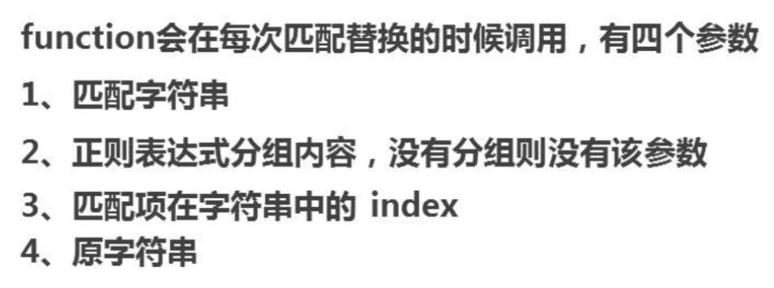

# 正则表达式

 **修饰符** 

* i，执行对大小写不敏感的匹配。
* g， 执行全局匹配（查找所有匹配而非在找到第一个匹配后停止）。
* m，执行多行匹配。

## 用来记录文本规则的代码

## 表单验证、高级搜索、生化科学

## 由普通字符和元字符组成

1. 内置对象法，var reg1 = new RegExp\(/abc/\);\(可定义空正则表达式\)
2. 字面量 var reg2 = /def/;

## 正则表达式有一个方法test\(\),检测字符串是否符合该规则。返回true或false。

* reg2.test\("def"\);
* /abc/.test\("abac"\);

## 五大内部类

1. 预定义类 
2. 简单类（正则：//中什么特殊符号都不写，和\[\]的加入） 
3. 负向类 中括号内，前面加个元字符^进行取反，不是括号里面的字符（一部分也不行）。 \(可以不够，但是不能多\)（不够和正好，返回false；多了或者没有返回true）

   ```text
   console.log(/[^abc]/.test('a'));
   console.log(/[^abc]/.test('gg'));
   ```

   注意: 这个符号 ^ 一定是写到方括号里面

4. 范围类 有时匹配的东西过多，而且类型又相同，全部输入太麻烦，我们可以在中间加了个横线

   ```text
   console.log(/[a-z]/.test('1111'));
   console.log(/[A-Z]/.test('aa'));
   ```

5. 组合类 用中括号匹配不同类型的单个字符。 `console.log(/[a-m1-5]/.test("b"))//true`

## 正则边界

^ 会匹配行或者字符串的起始位置 注：^在\[\]中才表示非！这里表示开始 $ 会匹配行或字符串的结尾位置 ^$在一起 表示必须是这个（精确匹配）

```text
// 边界可以精确说明要什么
console.log(/lily/.test("lilyname")); // true
console.log(/^lily$/.test("lily"));  // true
console.log(/^lily$/.test("ly"));   // false
```

`console.log(/^andy$/.test("andy")); // true` 这个的最终意思就是说，必须是 andy 这四个字母

## 量词

```text
 *   (贪婪)   重复零次或更多   (>=0)
 +   (懒惰)   重复一次或更多次  (>=1)
 ?    (占有)   重复零次或一次   （0||1）  要么有 要么没有
 {}  重复多少次的意思   可以有多少个  
您的银行卡密码只能是 6位      {6}
{n}    n次    （x=n）  
{n,}    重复n次或更多  (x>=n)
{n,m} 重复出现的次数比n多但比m少 (n<=x<=m)
*        {0,}
+        {1,}
?        {0,1}

x|y    一个 |   x  或者 y（没有&，用的是，代替的） 
（）提高权限，有限计算
```

## 非贪婪模式在贪婪模式的量词后面添加“？”

## 案例

* 匹配座机号

  ```text
  var regexp  = /^(0\d{2}-\d{8})|(0\d{3}-\d{7})$/;
  var demo    = /^0\d{2}-\d{8}$|^0\d{3}-\d{7}$/;
  ```

* 匹配中文 `/^[\u4e00-\u9fa5]{2,4}$/`

### 其他规则

#### IDE中的使用

```text
\b表示单词边界
.表示任意字符
+表示至少有一个
\表示转义字符
例： http:\/\/.+\.jpg
匹配：http:(\/\/.+\.jpg)    //分组
替换：$1(如果要替换为$1，转义\$1)

匹配： ^(\d{4})[/-](\d{2})[/-](\d{2})$
```


#### JS的使用

```text
//字面量
var reg = /\bis\b/g;    //g表示global,全文匹配
'He is a boy.This is a dog.Where is she?'.replace(reg, 'IS');
//构造函数
var reg = new RegExp('\\bis\\b', 'g');
```

### 修饰符

* g: global全文搜索，不添加，搜索到第一个匹配停止
* i:ignore case忽略大小写，默认大小写敏感
* m:multiple lines多行搜索

### 元字符

元字符是在正则表达式中有特殊含义的非字母字符


* 字符类

我们可以使用元字符\[\]来构建一个简单的类

所谓类是指符合某些特征的对象，一个泛指，而不是特指某个字符

* 范围类

可以使用\[a-z\]来连接两个字符表示从a到z的任意字符

需要加横斜，要加在后边\[0-9-\]

### 预定义类及边界


### 量词


### 正则贪婪模式与非贪婪模式

* 默认为贪婪模式，尽可能多的匹配

```text
'12345678'.replace(/\d{3,6}/g, 'X');   //X78
```

* 非贪婪模式

在量词后边加上?即可

```text
'12345678'.replace(/\d{3,6}?/g, 'X');   //XX78
```

### 分组

Byron{3},只能使n重复三次，两次只能作用于紧挨着它的，而不能作用于整个单词

使用\(\)可以达到分组的功能，使量词作用于分组，\(Byron\){3}

#### 或

使用\|可以达到或的效果,Byron\|Casper,Byr\(on\|Ca\)sper


#### 反向引用

```text
2015-12-25 => 12/25/2015
'2015-12-25'.replace(/(\d{4})-(\d{2})-(\d{2})/g, '$2/$3/$1');
```

#### 忽略分组

不希望捕获某些分组，只需要在分组内加上?:就可以，\(?:Byron\).\(ok\)

### 前瞻

前瞻就是爱正则表达式匹配到规s则的时候，向前检查是否符合断言，后顾/前瞻方向相反

Javascript不支持后顾

符合和不符合特定断言称为肯定/否定匹配和否定/负向匹配


### JS对象属性


```text
var reg1 = /\w/;
var reg2 = /\w/gim;
```

reg1.global属性为只读，不能对它进行设置

reg1.source是正则表达式的文本内容

#### RegExp.prototype.test\(str\)

用于测试字符串参数中是否存在匹配正则表达式模式的字符串，返回true或false

```text
var reg2 = /\w/g;

while(reg2.test('ab')){
    console.log(reg2.lastIndex);
}
```

全局匹配时，lastIndex属性会起作用，并干扰test\(\)的结果，解决办法： 1.去掉g;2.\(/\w/g\).test\('ab'\)

#### RegExp.prototype.exec\(str\)

使用正则表达式模式对字符串执行搜索，并将更新全局RegExp对象的属性以反映匹配结果

如果没有匹配的文本则返回null，否则返回一个结果数组：

* index声明匹配文本的第一个字符的位置
* input存放被检索的字符串string


### 字符串对象方法

#### String.prototype.search\(reg\)

* search方法用于检索字符串中指定的子字符串，或检索与正则表达式相匹配的子字符串
* 方法返回第一个匹配结果index,差找不到返回-1
* search方法不执行全局匹配，它将忽略标志g,并且总是从字符串的开始能行搜索


传入的参数不是正则时，会尝试把它转成正则，所有数字类型也可以

#### String.prototype.match\(reg\)

* match方法将检索字符串，以找到一个或多个与regexp匹配的文本
* regexp是否具有标志g对结果影响很大


#### splice


#### replace





